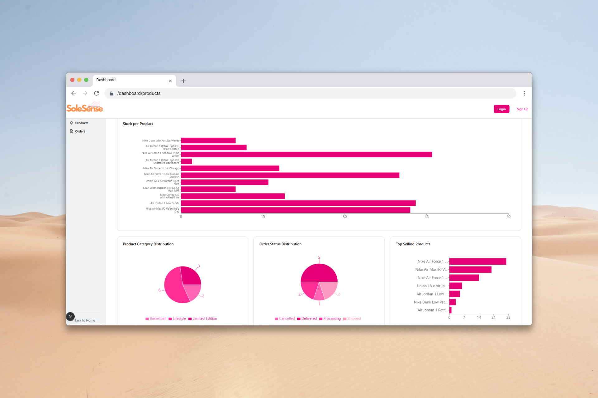

## SoleSense
SoleSense is a responsive admin dashboard built to manage an e-commerce shoe store.
It allows admins to manage products, view orders, and track stock while providing users with read-only access to product information.
The project demonstrates full-stack skills, including database management, authentication, analytics, and payment integration.

Technical Blog : https://shorturl.at/iewq5

Live Demo: https://sole-sense.vercel.app/

## Tech Stack
- Frontend: Next.js, Tailwind CSS, shadcn/ui
- Backend & Database: Supabase (Auth, Database, Storage)
- Charts & Analytics: Recharts

## Features
- Admin authentication with role-based access
- CRUD operations for products (admin only)
- Orders dashboard with stock and sales analytics
- Responsive design for desktop & mobile
- Integration with Supabase

## Screenshots

  
  
  
  

## Setup / Installation

1. Clone the repository:

   git clone https://github.com/yourusername/solesense.git

   cd solesense

3. Install dependencies:

   npm install

4. Create .env.local with your Supabase keys:

   NEXT_PUBLIC_SUPABASE_URL=<your-supabase-url>
   NEXT_PUBLIC_SUPABASE_ANON_KEY=<your-supabase-anon-key>

5. Run the development server:
   npm run dev

   Open http://localhost:3000
 to view the project locally.

## Future Improvements

- Real-time stock updates
- Advanced analytics filters
- User profile management
- Enhanced mobile UX
